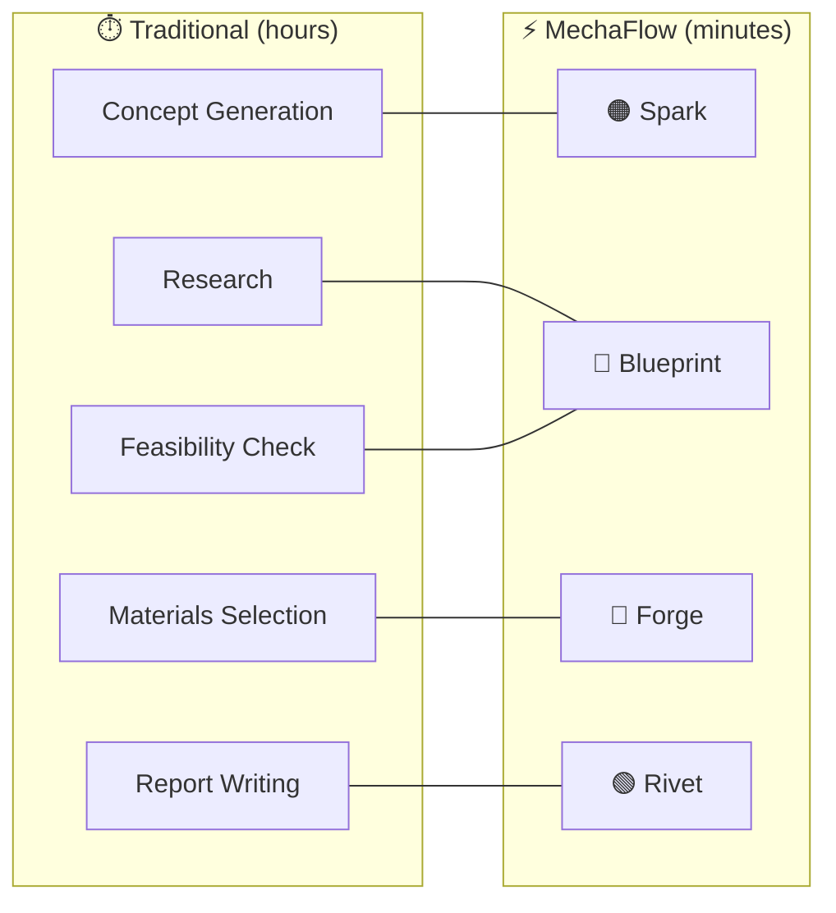
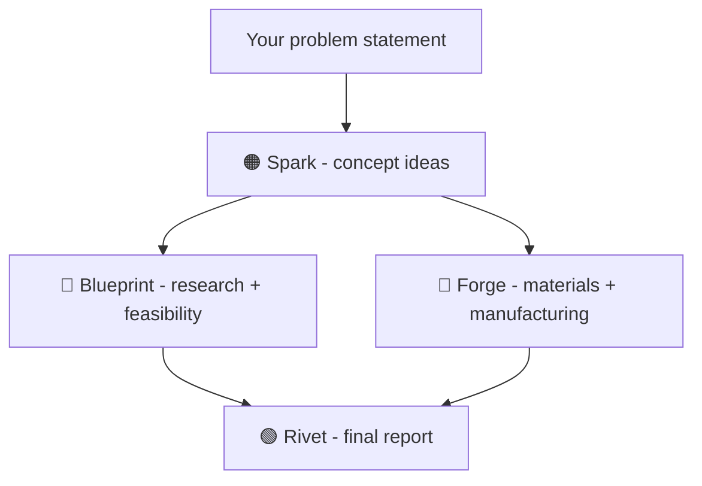

<div align="center">
  
</div>


<div align="center">

 &nbsp;  &nbsp; 

</div>


<div align="center">
An AI-powered web app with multiple agentic workflows that accelerates
the mechanical engineering design process from problem to finished product
</div>

## Demo
&nbsp;&nbsp;&nbsp; | video coming soon...

## Overview

| The Problem | The Solution |
|---|---|
| Engineers spend hours on research, material selection, and documentation instead of actual building.. |A 4-agent AI pipeline that takes you from a raw problem statement to a finished report in minutes. |




Why independent agents instead of a locked pipeline?
Engineers rarely work linearly. You might already have a concept and just need materials research. You might want to run Spark twice with different constraints. Independent agents give you flexibility without sacrificing the ability to chain them end-to-end.

## Meet The Agents
<h3><span style="color:#ED4F00">🟠 Spark</span> — Idea Generation</h3>
Describe your problem. Then Spark returns multiple solutions from established approaches to unconventional ones.
It doesn't choose for you. It makes sure you're not missing anything before you do.
Output: Written concept descriptions. Precise enough to sketch or take straight to CAD.

<h3><span style="color:#0046B6">🔵  Blueprint</span> — Research & Mapping</h3>
Blueprint maps the problem space before you commit to a direction. Relevant standards, constraints, prior art, feasibility of proposed solutions.
It doesn't assume anything instead Gaps and uncertainties are flagged .
Output: Problem analysis, feasibility ratings, and open questions to resolve before proceeding.


<h3><span style="color:#AD0000">🔴  Forge</span> — Materials & Manufacturing</h3>
Forge takes your solution concept and breaks down exactly what it's made of and how to build it. It covers materials, processes, and tolerances, adjusting its recommendations based on whether you're building a prototype or going to production.
Output: Ranked material options, process recommendations, tolerances, and failure modes to watch out for.


<h3><span style="color:#13601B">🟢  Rivet</span> — Report Writing</h3>
Rivet pulls together everything from the previous agents: the problem, Spark's ideas, Blueprint's research, and Forge's recommendations. It then turns it all into a single engineering report.
Output: A structured report with an executive summary, technical analysis, materials section, recommendations, and open items.


## How It Works
Each agent runs independently — you can use them in any order, or feed the output of one as the input to another to build a complete pipeline.




          

Why independent agents instead of a locked pipeline?
Engineers rarely work linearly. You might already have a concept and just need materials research. You might want to run Spark twice with different constraints. Independent agents give you flexibility without sacrificing the ability to chain them end-to-end.


## Design Process

Mockup - designed in Framer


Final build - 


## Tech Stack


| Layer        | Technology                     | Why                                                                 |
|--------------|-------------------------------|----------------------------------------------------------------------|
| Framework    | Next.js (App Router)          | Built by Vercel (the hosting platform), so deployment is seamless. Enables server-side API routes, keeping API keys secure and never exposed to the browser. |
| Language     | TypeScript                    | Catches errors early, especially useful when working with AI-generated code. Ensures type safety and consistency across the codebase. |
| Styling      | Tailwind CSS                  | Utility-first approach allows rapid UI development directly in JSX. Eliminates context switching and avoids CSS complexity like naming and specificity issues. |
| AI SDK       | @anthropic-ai/sdk             | Official SDK that handles authentication, retries, streaming, and type safety. More reliable and maintainable than raw `fetch()` calls. |


## Project Structure


```
  

mechaflow/
├── app/                        
│   ├── layout.tsx                
│   ├── page.tsx                  
│   ├── globals.css              
│   │
│   ├── spark/
│   │   └── page.tsx            
│   ├── blueprint/
│   │   └── page.tsx             
│   ├── forge/
│   │   └── page.tsx            
│   └── rivet/
│       └── page.tsx             
│
├── app/api/                      
│   ├── spark/
│   │   └── route.ts              
│   ├── blueprint/
│   │   └── route.ts             
│   ├── forge/
│   │   └── route.ts              
│   └── rivet/
│       └── route.ts              
│
├── components/                  
│   ├── AgentCard.tsx            
│   ├── PromptInput.tsx           
│   ├── StreamingOutput.tsx      
│   └── AgentHeader.tsx          
│
├── lib/
│   └── anthropic.ts              
│
├── public/
│   └── logo.svg                 
│
├── CLAUDE.md                     
├── .env.local                   
├── .env.local.example            
├── .gitignore
├── next.config.ts
├── package.json
├── tailwind.config.ts
└── tsconfig.json
```


## Deployemnt

&nbsp;&nbsp;&nbsp; | link coming soon...


## 🚧Roadmap🚧  
Video Demo  
Deployment


