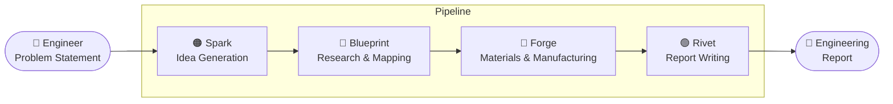

  

 &nbsp;  &nbsp; 

An AI-powered web app with multiple agentic workflows that accelerates
the mechanical engineering design process from problem to finished product

## Demo
&nbsp;&nbsp;&nbsp; | video coming soon...

## Overview

| The Problem | The Solution |
|---|---|
| Engineers spend hours on research, material selection, and documentation — not actual engineering. | A 4-agent AI pipeline that takes you from raw problem statement to a finished report in minutes. |

## Meet The Agents
<h3>🟠 Spark — Idea Generation</h3>
You describe the problem. Spark returns a set of distinct solution concepts — from established approaches to unconventional ones.
It doesn't choose for you. It makes sure you're not missing anything before you do.
Output: Written concept descriptions. Precise enough to sketch or take straight to CAD.

<h3>🔵  Blueprint — Research & Mapping</h3>
Blueprint maps the problem space before you commit to a direction. Relevant standards, constraints, prior art, feasibility of proposed solutions.
Gaps and uncertainties are flagged — not assumed away.
Output: Problem analysis, feasibility ratings, and open questions to resolve before proceeding.

<h3>🔴  Forge — Materials & Manufacturing</h3>
Takes a solution concept and works out what it's actually made of and how it gets built. Materials, processes, tolerances — calibrated to whether you're prototyping or going to production.
Output: Ranked material options, process recommendations, tolerances, and failure modes to watch for.

<h3>🟢  Rivet — Report Writing</h3>
Pulls from everything — the problem, Spark's ideas, Blueprint's research, Forge's recommendations — and writes the engineering report.
Output: Structured report with executive summary, technical analysis, materials section, recommendations, and open items.

## Design Process

Mockup - designed in Framer

Final build - 

&nbsp; | Coming soon...

## Tech Stack

| Layer | Technology |
|---|---|
Frontend | React + Vite
Styling | Tailwind CSS
AI | Anthropic Claude API
Deployment | Vercel

