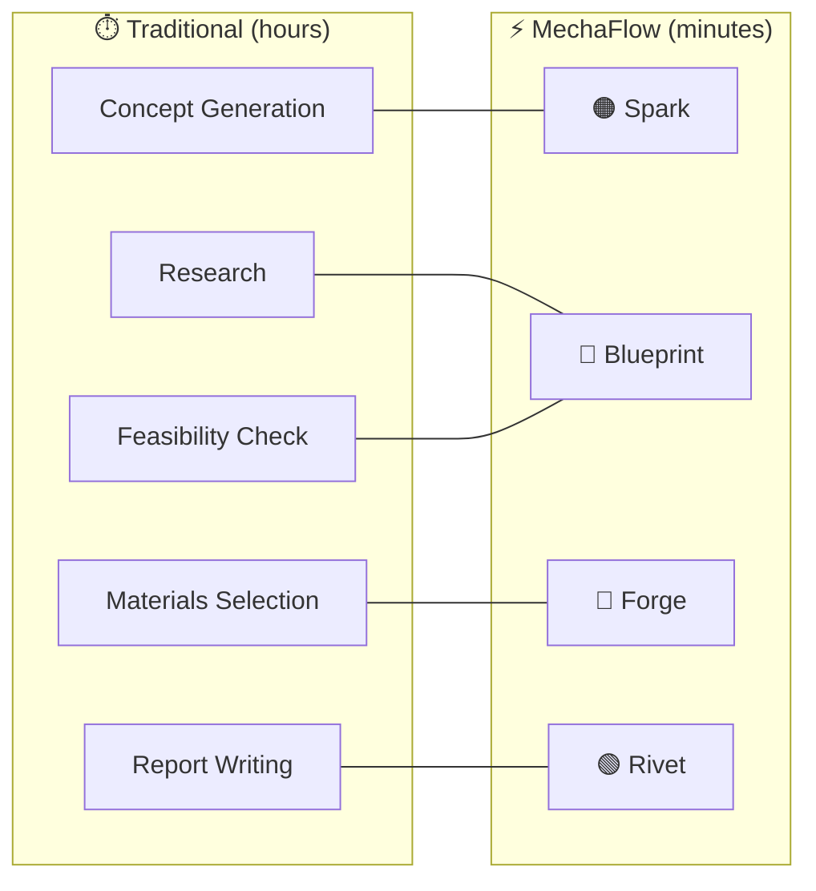
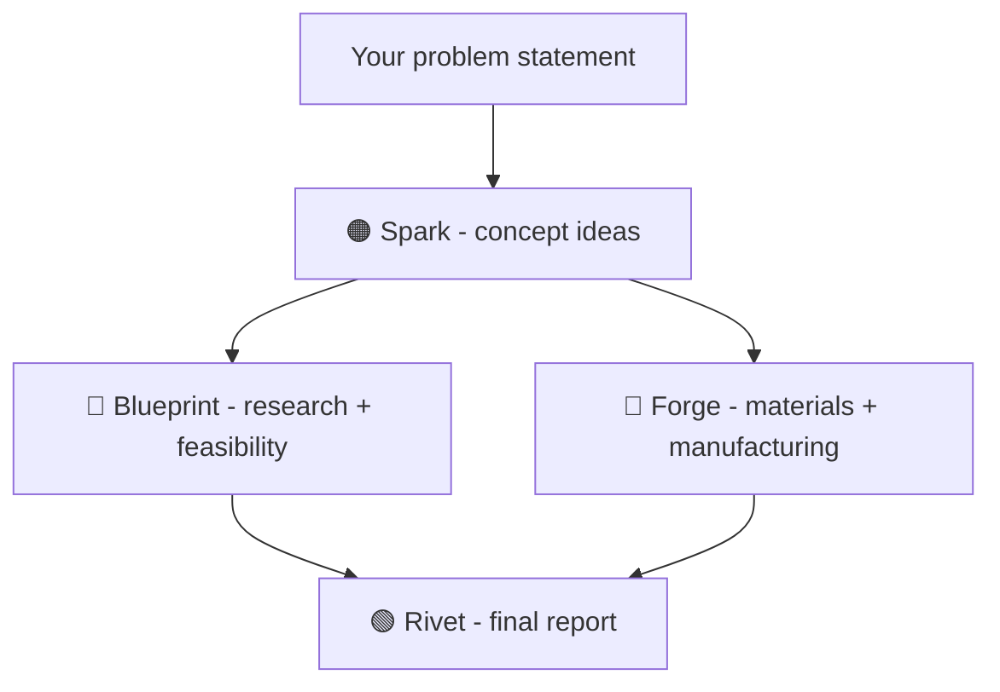

<div align="center">
  
</div>


<div align="center">

 &nbsp;  &nbsp; 

</div>


<div align="center">
An AI-powered web app with multiple agentic workflows that accelerates
the mechanical engineering design process from problem to finished product
</div>

## Demo
&nbsp;&nbsp;&nbsp; | video coming soon...

## Overview

| The Problem | The Solution |
|---|---|
| Engineers spend hours on research, material selection, and documentation — not actual engineering. | A 4-agent AI pipeline that takes you from raw problem statement to a finished report in minutes. |




Why independent agents instead of a locked pipeline?
Engineers rarely work linearly. You might already have a concept and just need materials research. You might want to run Spark twice with different constraints. Independent agents give you flexibility without sacrificing the ability to chain them end-to-end.

## Meet The Agents
<h3><span style="color:#ED4F00">🟠 Spark</span> — Idea Generation</h3>
You describe the problem. Spark returns a set of distinct solution concepts — from established approaches to unconventional ones.
It doesn't choose for you. It makes sure you're not missing anything before you do.
Output: Written concept descriptions. Precise enough to sketch or take straight to CAD.

<h3><span style="color:#0046B6">🔵  Blueprint</span> — Research & Mapping</h3>
Blueprint maps the problem space before you commit to a direction. Relevant standards, constraints, prior art, feasibility of proposed solutions.
Gaps and uncertainties are flagged — not assumed away.
Output: Problem analysis, feasibility ratings, and open questions to resolve before proceeding.

<h3><span style="color:#AD0000">🔴  Forge</span> — Materials & Manufacturing</h3>
Takes a solution concept and works out what it's actually made of and how it gets built. Materials, processes, tolerances — calibrated to whether you're prototyping or going to production.
Output: Ranked material options, process recommendations, tolerances, and failure modes to watch for.

<h3><span style="color:#13601B">🟢  Rivet</span> — Report Writing</h3>
Pulls from everything — the problem, Spark's ideas, Blueprint's research, Forge's recommendations — and writes the engineering report.
Output: Structured report with executive summary, technical analysis, materials section, recommendations, and open items.


## How It Works
Each agent runs independently — you can use them in any order, or feed the output of one as the input to another to build a complete pipeline.




          

Why independent agents instead of a locked pipeline?
Engineers rarely work linearly. You might already have a concept and just need materials research. You might want to run Spark twice with different constraints. Independent agents give you flexibility without sacrificing the ability to chain them end-to-end.


## Design Process

Mockup - designed in Framer


Final build - 


## Tech Stack


| Layer        | Technology                     | Why                                                                 |
|--------------|-------------------------------|----------------------------------------------------------------------|
| Framework    | Next.js (App Router)          | Built by Vercel (the hosting platform), so deployment is seamless. Enables server-side API routes, keeping API keys secure and never exposed to the browser. |
| Language     | TypeScript                    | Catches errors early, especially useful when working with AI-generated code. Ensures type safety and consistency across the codebase. |
| Styling      | Tailwind CSS                  | Utility-first approach allows rapid UI development directly in JSX. Eliminates context switching and avoids CSS complexity like naming and specificity issues. |
| AI SDK       | @anthropic-ai/sdk             | Official SDK that handles authentication, retries, streaming, and type safety. More reliable and maintainable than raw `fetch()` calls. |


## Project Structure


```
  

mechaflow/
├── app/                          # Next.js App Router pages
│   ├── layout.tsx                # Root layout — fonts, global styles, nav
│   ├── page.tsx                  # Home/landing page — agent selector
│   ├── globals.css               # Tailwind base styles + CSS variables
│   │
│   ├── spark/
│   │   └── page.tsx              # 🟠 Spark agent UI
│   ├── blueprint/
│   │   └── page.tsx              # 🔵 Blueprint agent UI
│   ├── forge/
│   │   └── page.tsx              # 🔴 Forge agent UI
│   └── rivet/
│       └── page.tsx              # 🟢 Rivet agent UI
│
├── app/api/                      # Server-side API routes (Claude calls go here)
│   ├── spark/
│   │   └── route.ts              # POST /api/spark
│   ├── blueprint/
│   │   └── route.ts              # POST /api/blueprint
│   ├── forge/
│   │   └── route.ts              # POST /api/forge
│   └── rivet/
│       └── route.ts              # POST /api/rivet
│
├── components/                   # Reusable UI components
│   ├── AgentCard.tsx             # Card on home page for each agent
│   ├── PromptInput.tsx           # Textarea + submit button, shared across agents
│   ├── StreamingOutput.tsx       # Renders streamed markdown from Claude
│   └── AgentHeader.tsx           # Agent name, color, description header
│
├── lib/
│   └── anthropic.ts              # Anthropic client singleton + system prompts
│
├── public/
│   └── logo.svg                  # MechaFlow logo
│
├── CLAUDE.md                     # 🤖 Instructions for Claude Code (vibe coding context)
├── .env.local                    # Local secrets — NEVER commit this
├── .env.local.example            # Template for required env vars — safe to commit
├── .gitignore
├── next.config.ts
├── package.json
├── tailwind.config.ts
└── tsconfig.json
```


## Deployemnt

&nbsp;&nbsp;&nbsp; | link coming soon...


## 🚧Roadmap🚧  

PDF downloads  
Deployments  
Video Demo  


